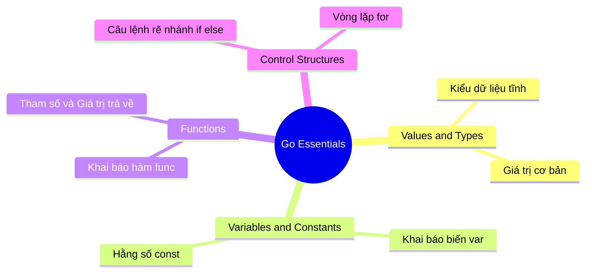

# Phần 2: Kiến Thức Go Cốt Lõi (Go Essentials)

> [!NOTE]
> *Sau khi hoàn thành phần khởi động và viết chương trình đầu tiên, phần học này sẽ đưa bạn đi sâu vào những khái niệm nền tảng mà bạn sẽ sử dụng trong mọi dự án Go sau này.*

---

## 🎯 Mục Tiêu Của Phần Học Này

Chúng ta sẽ bóc tách các thành phần chính cấu tạo nên mọi chương trình Go và tìm hiểu cách kiểm soát dữ liệu cũng như luồng thực thi của ứng dụng.

### 🗺️ Các Khái Niệm Sẽ Khám Phá

---

## 📝 Chi Tiết Các Nội Dung Chính

### 1. Thành Phần Chủ Chốt Trong Chương Trình Go
* Hiểu rõ cấu trúc và các thành phần cấu tạo nên một file code Go hoàn chỉnh.
* Nhận diện các thành phần luôn xuất hiện trong mọi chương trình.

### 2. Giá Trị & Kiểu Dữ Liệu (Values & Types)
* Tìm hiểu cơ chế quản lý kiểu dữ liệu tĩnh nghiêm ngặt của Go.
* Cách phân loại và làm việc với các kiểu dữ liệu cơ bản.

### 3. Biến & Hằng Số (Variables & Constants)
* Cách khai báo, khởi tạo và sử dụng biến (`var`, cú pháp viết tắt `:=`).
* Cách khai báo hằng số (`const`) để lưu trữ các giá trị không đổi.

### 4. Hàm (Functions)
* Tìm hiểu ý tưởng cốt lõi đằng sau việc sử dụng hàm.
* Cách khai báo hàm (`func`), truyền tham số đầu vào và nhận kết quả trả về.

### 5. Cấu Trúc Điều Khiển (Control Structures)
* Sử dụng các câu lệnh điều kiện để kiểm soát luồng chạy của chương trình.
* Quyết định đoạn mã nào sẽ được chạy, chạy khi nào và lặp lại ra sao.

---

> [!TIP]
> *Đây là phần học chứa nhiều lý thuyết nền tảng quan trọng nhất. Hãy chuẩn bị sẵn sàng trình soạn thảo VS Code để cùng thực hành viết mã nguồn liên tục nhé!*
