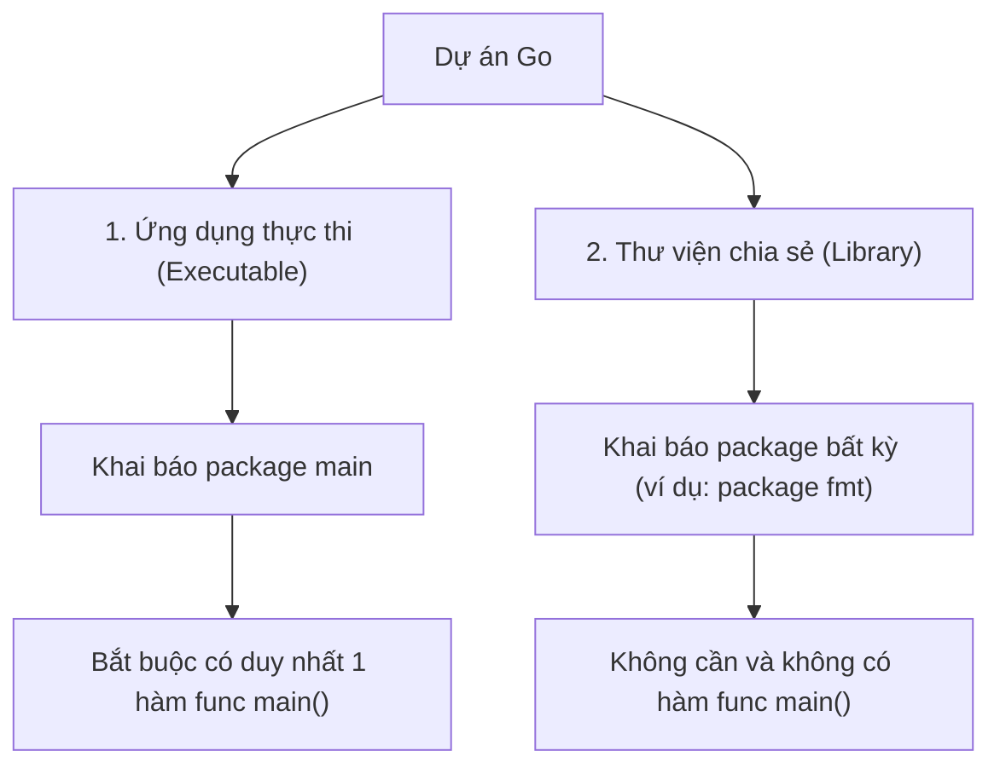

# Bài 5: Quy Tắc Bắt Buộc Của Hàm "main" trong Go

> [!NOTE]
> *Bên cạnh package main, hàm `main()` là thành phần cốt lõi thứ hai cấu thành nên điểm chạy của ứng dụng. Bài học này sẽ giúp bạn hiểu rõ cơ chế hoạt động và các quy tắc nghiêm ngặt xung quanh hàm đặc biệt này.*

---

## 🏁 1. Hàm `main()` là gì và vai trò của nó?

Hàm (function) là một khối mã chứa các câu lệnh thực thi được gom nhóm lại. 

* **Điểm kích hoạt:** Hàm `main()` đóng vai trò là **điểm bắt đầu thực thi code** của chương trình.
* **Cơ chế:** Khi bạn chạy ứng dụng (ví dụ bằng `./first-app`), Go Engine sẽ tự động tìm kiếm hàm `main()` này và chạy các câu lệnh bên trong nó đầu tiên.

---

## ⚠️ 2. Quy Tắc Tổ Chức Code Trong File Go

Khác với một số ngôn ngữ kịch bản (như JavaScript hay Python) chạy trực tiếp các câu lệnh từ đầu đến cuối file, Go có các quy định nghiêm ngặt:

* **Không viết code tự do:** Bạn không thể viết trực tiếp các lệnh thực thi (như `fmt.Print(...)`) nằm tự do bên ngoài các hàm.
* **Các thành phần được viết ngoài hàm:** Chỉ có khai báo `package`, câu lệnh `import` (và một số khai báo biến toàn cục hoặc cấu trúc dữ liệu sẽ học sau) là được phép nằm ngoài hàm.
* **Bắt buộc bọc logic:** Hầu hết mọi logic xử lý của chương trình đều phải được bọc bên trong các hàm cụ thể.

---

## 🚫 3. Quy Tắc Độc Nhất (Chỉ có duy nhất một hàm `main`)

Trong cùng một package, bạn chỉ được phép khai báo **duy nhất một hàm `main()`**.

* **Nhiều file trong một package:** Bạn có thể tạo nhiều file `.go` thuộc cùng `package main`. Tuy nhiên, các file phụ này **không được phép** chứa thêm một hàm `func main()` nào khác.
* **Lỗi trùng lặp:** Nếu bạn cố tình viết hai hàm `main()` trong cùng một package, trình biên dịch sẽ báo lỗi:
  ```text
  main is re-declared in this block
  ```
  *(Lỗi khai báo lặp lại phần tử trùng tên).*

---

## ⚖️ 4. Phân Biệt: Ứng Dụng Thực Thi vs Thư Viện (Library)

Sự hiện diện của hàm `main()` cũng là ranh giới phân biệt giữa hai loại dự án Go:



* **Ứng dụng thực thi (Executable Program):** Cần đóng gói thành file chạy nhị phân độc lập. Bắt buộc cần có `package main` và `func main()`.
* **Thư viện (Library / Package):** Ví dụ như package `fmt` của thư viện chuẩn. Nó chỉ được viết ra nhằm mục đích cho các dự án khác `import` vào và sử dụng các hàm bổ trợ của nó, chứ không chạy độc lập. Do đó nó không có và không cần hàm `main()`.
