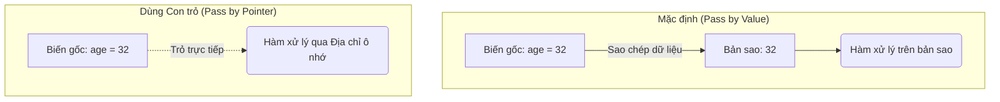

# Bài 02: Cơ Chế Hoạt Động Của Con Trỏ Trong Bộ Nhớ RAM

> [!NOTE]
> *Để hiểu rõ bản chất của con trỏ, chúng ta cần hình dung cách máy tính tổ chức bộ nhớ RAM và cách các đoạn code Go tương tác với tài nguyên phần cứng này.*

---

## 🧠 1. Hình Dung Về Bộ Nhớ Máy Tính (RAM Layout)

Hãy tưởng tượng bộ nhớ RAM của máy tính giống như một dãy các ngăn tủ dài vô tận:
* Mỗi ngăn tủ có một **địa chỉ số nhà** duy nhất (ví dụ dưới dạng số Hexa: `0xc000012088`).
* Mỗi ngăn tủ dùng để lưu trữ một **giá trị** cụ thể.

Khi bạn viết code:
```go
age := 32
```
Máy tính sẽ tìm một ngăn tủ trống, gán cho nó nhãn tên là `age`, lưu giá trị `32` vào đó. Hệ điều hành tự động cấp phát một địa chỉ cho ngăn tủ này (ví dụ: `0xc000012088`).

Nếu bạn tạo một con trỏ trỏ đến `age`:
```go
agePointer := &age
```
Biến `agePointer` cũng nằm trong một ngăn tủ khác, nhưng giá trị được lưu bên trong nó không phải là một con số thông thường, mà chính là **địa chỉ ô nhớ** `0xc000012088` của biến `age`.

---

## ⚖️ 2. Phân Tích Sâu Hai Ưu Điểm Của Con Trỏ

### Ưu điểm 1: Tránh tạo bản sao dữ liệu dư thừa (Avoid Value Copies)

Theo mặc định trong Go, khi bạn truyền một biến vào một hàm:
1. Go sẽ tạo ra một **bản sao hoàn toàn mới** của giá trị đó trong RAM.
2. Hàm sẽ tính toán trên bản sao này.
3. Sau khi hàm chạy xong, bộ dọn rác tự động của Go (Garbage Collector - GC) sẽ chạy ngầm để xóa bản sao này giải phóng bộ nhớ.



* **Vấn đề:** Nếu dữ liệu của bạn có dung lượng lớn (Struct lớn, mảng dữ liệu khổng lồ), việc sao chép này sẽ ngốn RAM và bắt Garbage Collector làm việc vất vả, làm giảm hiệu năng ứng dụng.
* **Giải pháp:** Truyền con trỏ (địa chỉ ô nhớ) chỉ tốn một lượng dung lượng cố định cực nhỏ (thông thường là 8 bytes trên hệ điều hành 64-bit), bất kể dữ liệu gốc lớn thế nào.

> [!TIP]
> Đối với các kiểu dữ liệu cơ bản như số (`int`, `float64`) hay chuỗi ngắn (`string`), việc sao chép diễn ra cực kỳ nhanh nên việc tối ưu bằng con trỏ là không cần thiết. Con trỏ chỉ thực sự phát huy tác dụng hiệu năng với các cấu trúc dữ liệu phức tạp (Struct lớn).

---

## Ưu điểm 2: Chỉnh sửa trực tiếp dữ liệu (Direct Mutation)

Khi truyền con trỏ vào hàm, hàm đó có thể truy cập trực tiếp vào ô nhớ gốc để thay đổi giá trị của nó mà không cần sử dụng câu lệnh `return` để nhận lại kết quả.

### ⚠️ Cảnh báo về mặt Thiết kế (Clean Code Warning)
Dù giúp viết code ngắn hơn (không cần `return`), việc thay đổi trực tiếp giá trị qua con trỏ đôi khi có thể dẫn đến **code khó hiểu** hoặc **lỗi ngoài ý muốn** (side effects):

* **Ví dụ gây hiểu lầm**: Một hàm tên là `add(a, b)` thông thường sẽ trả về tổng của $a + b$ và giữ nguyên hai biến đầu vào. Nhưng nếu bạn truyền con trỏ và hàm tự động cộng dồn kết quả vào biến `a`, người đọc code sẽ bị bất ngờ vì giá trị của `a` đã bị thay đổi vĩnh viễn sau khi gọi hàm.
* **Lời khuyên**: Chỉ sử dụng con trỏ để thay đổi dữ liệu khi tên hàm thể hiện rõ hành vi biến đổi đó (ví dụ: `updateAge(userPointer, newAge)`), hoặc khi thiết kế các phương thức (Methods) cập nhật trạng thái của một đối tượng Struct.
