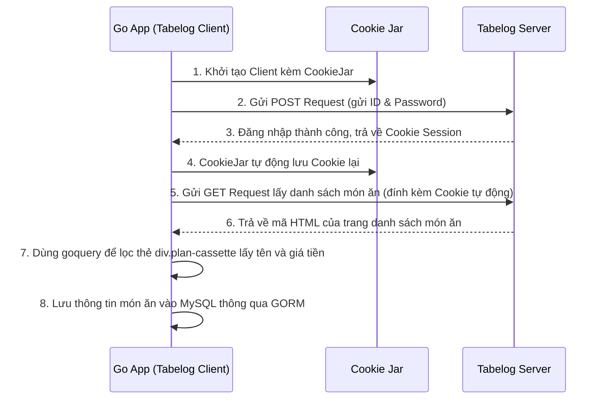

# Bài 01: Khảo Sát Dự Án Thực Tế - Gourmet Aggregation

> [!NOTE]
> *Tài liệu phân tích nghiệp vụ, công nghệ và cách thức hoạt động của dự án thực tế Gourmet Aggregation (Hệ thống gom dữ liệu đặt bàn nhà hàng) dành cho người mới bắt đầu học Go.*

---

## 📋 1. Tổng Quan Dự Án - Gourmet Aggregation Là Gì?

Hãy tưởng tượng bạn là chủ của một nhà hàng lớn tại Nhật Bản. Để tiếp cận nhiều khách hàng, bạn đăng ký bán bàn và nhận đặt chỗ trên **6 nền tảng khác nhau**: Tabelog (食べログ), Gurunavi (ぐるなび), Hotpepper, Retty, Ikyu, và Hitosara.

### 🔴 Vấn đề phát sinh:
* Mỗi khi có khách đặt bàn trên Tabelog, bạn phải đăng nhập vào trang quản trị của các bên còn lại để khóa bàn đó lại (tránh việc trùng bàn - Double Booking).
* Nhân viên của bạn phải tốn hàng giờ mỗi ngày để đăng nhập vào 6 trang web khác nhau chỉ để kiểm tra xem hôm nay có bao nhiêu khách đặt, thực đơn họ chọn là gì.

### 🟢 Giải pháp từ Gourmet Aggregation:
Đây là một **Hệ thống trung gian** viết bằng Go. Nó tự động đóng vai trò là "nhân viên ảo":
1. Tự động đăng nhập vào 6 nền tảng trên.
2. Cào (Scrape) toàn bộ thông tin đặt bàn, sơ đồ bàn, thực đơn về một Database duy nhất.
3. Cung cấp API để phần mềm giao diện (Frontend) hiển thị toàn bộ lịch trình đặt bàn của cả 6 nền tảng tại một màn hình duy nhất cho chủ nhà hàng.

---

## 🧠 2. Chi Tiết Nghiệp Vụ Cần Giải Quyết (Business Logic)

Dự án cần xử lý 2 nhóm nghiệp vụ chính:

### Luồng 1: Đồng bộ dữ liệu tĩnh (Master Data Sync)
Nhà hàng cần đồng bộ các thông tin cơ bản từ các sàn về hệ thống:
* **Danh sách bàn (Tables):** Số lượng bàn, sức chứa của từng bàn, bàn hút thuốc hay không hút thuốc.
* **Danh sách thực đơn (Courses/Menus):** Tên set ăn, giá tiền, mô tả món ăn.
* **Tài khoản liên kết (Gourmet Accounts):** Lưu trữ thông tin đăng nhập (Username/Password) của từng sàn để hệ thống có quyền cào dữ liệu.

### Luồng 2: Đồng bộ lịch đặt bàn thời gian thực (Real-time Bookings)
Khi có khách đặt bàn mới, thay đổi lịch hoặc hủy bàn trên sàn, hệ thống phải cập nhật ngay lập tức:
* Tên khách hàng, số điện thoại, email.
* Thời gian đến, thời gian đi, số lượng người lớn/trẻ em.
* Set ăn họ đã chọn, ghi chú đặc biệt (ví dụ: dị ứng thức ăn).

---

## 🛠️ 3. Công Nghệ Sử Dụng & Lý Do Lựa Chọn

Để giải quyết các nghiệp vụ trên, dự án sử dụng các công nghệ và thư viện sau trong Go:

| Tên Công Nghệ / Thư Viện | Vai Trò Trong Dự Án | Giải Thích Cho Người Mới |
| :--- | :--- | :--- |
| **Ngôn ngữ Go** | Ngôn ngữ phát triển chính | Go chạy cực nhanh, tốn ít RAM và xử lý bất đồng bộ (Concurrency) rất tốt, cực kỳ thích hợp cho các tác vụ cào dữ liệu song song nhiều trang web. |
| **`net/http`** | Thư viện mạng chuẩn của Go | Dùng để gửi các request (GET, POST) đến trang quản trị của đối tác để lấy dữ liệu. |
| **`net/http/cookiejar`** | Quản lý Cookie tự động | Khi bạn đăng nhập vào web, trình duyệt lưu Cookie. Thư viện này giúp Go lưu trữ Cookie đó để các request sau không bị đá ra ngoài. |
| **`github.com/PuerkitoBio/goquery`** | Phân tích cú pháp HTML | Dùng để đọc mã nguồn HTML của trang web đối tác, tìm các thẻ div, class, table chứa thông tin cần thiết và lấy dữ liệu ra giống như cách viết CSS/jQuery. |
| **`Gin-gonic/gin`** | Web Framework | Dùng để dựng các đường dẫn API (Endpoints) giúp Frontend có thể gọi lên lấy dữ liệu đặt bàn đã gom về. |
| **`GORM` & `MySQL`** | ORM và Hệ quản trị cơ sở dữ liệu | MySQL dùng để lưu trữ dữ liệu. GORM là thư viện giúp Go tương tác với MySQL bằng code Go (thao tác trực tiếp trên Struct) thay vì viết truy vấn SQL thuần. |
| **`crypto/aes`** | Mã hóa dữ liệu mật khẩu | Dùng thuật toán AES-256 để mã hóa mật khẩu tài khoản sàn của khách hàng trước khi lưu vào database để đảm bảo an toàn tuyệt đối. |
| **`regexp`** | Thư viện Regular Expression | Dùng để phân tích nội dung email. Khi nhận được email thông báo đặt bàn, Regex sẽ quét và bóc tách các dòng chữ để lấy ra Tên, Số điện thoại, Ngày giờ đặt bàn. |

---

## 🚀 4. Làm Như Thế Nào? (Luồng Hoạt Động Chi Tiết)

### Quy trình 1: Cào Dữ Liệu Bằng Cách Giả Lập Trình Duyệt (Ví dụ với Tabelog)

### Quy trình 2: Cào Dữ Liệu Qua API Nội Bộ (GraphQL / JSON)
Nhiều trang web hiện đại sử dụng React/Vue để gọi API lấy dữ liệu. Thay vì cào HTML rất phức tạp:
1. Lập trình viên mở F12 Chrome, vào tab Network để tìm request API thật của trang web (ví dụ: `https://owner.tabelog.com/graphql`).
2. Viết code Go tạo đúng request Header (gồm `Origin`, `x-from`) và Request Body (câu lệnh GraphQL).
3. Gọi thẳng vào link API đó từ Go. Kết quả trả về là JSON sạch, Go chỉ cần chuyển đổi (Unmarshal) JSON thành Struct cực kỳ nhanh và chính xác.

### Quy trình 3: Xử Lý Đặt Bàn Qua Email (Email Parser)
1. Mỗi khi có khách đặt bàn, các sàn gửi email xác nhận đến email nhà hàng.
2. Go có một CLI tool chạy ngầm (`jobs/reservation_mail_handler`) đọc nội dung email này.
3. Sử dụng các mẫu Regex đã định nghĩa trước để trích xuất thông tin:
   * Tìm mẫu `［来店日時］(.*)` để lấy ngày giờ.
   * Tìm mẫu `［予約人数］(\d+)名` để lấy số lượng khách.
4. Sau khi bóc tách xong, Go lưu thẳng thông tin này vào cơ sở dữ liệu.

---

## 📂 5. Kiến Trúc Thư Mục Dự Án (Mô hình DDD)

Dự án được tổ chức theo cấu trúc **Domain-Driven Design (DDD)** rất chuyên nghiệp, chia làm nhiều tầng để dễ bảo trì:

* **Tầng Domain (`domain/`):**
  * Định nghĩa các thực thể cốt lõi (như `Store`, `Account`, `Course`, `Reservation`) dưới dạng các Struct của Go.
  * Đây là nơi chứa các quy tắc nghiệp vụ thuần túy, không phụ thuộc vào công nghệ cào hay cơ sở dữ liệu nào.
* **Tầng Infrastructure (`infrastructure/` & `apiClient/`):**
  * Nơi chứa code triển khai thực tế.
  * Thư mục `apiClient/` chứa các file cào dữ liệu cho từng sàn (`tabelog.go`, `gnavi.go`...).
  * Thư mục `persistence/` chứa code lưu dữ liệu vào MySQL thông qua GORM.
* **Tầng Application (`application/`):**
  * Chứa các HTTP Handler (sử dụng Gin Framework) để tiếp nhận yêu cầu từ Frontend và gọi xuống tầng Domain để xử lý.
* **Tầng Jobs (`jobs/`):**
  * Chứa các công cụ chạy ngầm bằng dòng lệnh (CLI) để xử lý tác vụ định kỳ như quét và đọc email xác nhận đặt bàn.

---

> [!TIP]
> **Lời khuyên cho người mới học:**
> * Hãy bắt đầu bằng cách học kỹ cách sử dụng gói **`net/http`** để gửi request và xử lý lỗi.
> * Tập viết các tool nhỏ cào dữ liệu từ các trang web tin tức bằng **`goquery`** trước khi chuyển sang làm các hệ thống giả lập đăng nhập phức tạp như dự án này.
