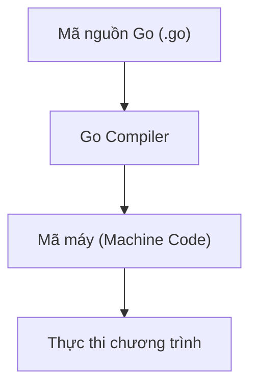

# Bài 2: Cài Đặt Go & Tìm Hiểu Về Go Compiler

> [!NOTE]
> *Để bắt đầu lập trình Go, bạn cần cài đặt bộ biên dịch (Compiler) của Go. Bài viết này hướng dẫn chi tiết cách cài đặt, kiểm tra môi trường và giải thích cơ chế hoạt động của trình biên dịch.*

---

## 1. Tại sao cần Go Compiler?
Vì Go là một **ngôn ngữ biên dịch (Compiled Language)**, máy tính không thể hiểu trực tiếp mã nguồn Go mà phải thông qua một trình biên dịch (Compiler) để chuyển mã nguồn thành mã máy (Machine Code) trước khi chạy.

### 🔄 Quy trình hoạt động của Go Compiler:


### 💡 Ví dụ thực tế:
Giả sử ta có file `main.go` với nội dung:
```go
package main

import "fmt"

func main() {
    fmt.Println("Hello, World!")
}
```

Khi bạn chạy lệnh:
```bash
go run main.go
```
Go Compiler sẽ thực hiện ngầm các bước:
1. **Biên dịch (Compile):** Đọc và dịch toàn bộ mã nguồn sang mã máy.
2. **Thực thi (Run):** Chạy chương trình từ mã máy vừa tạo ra.

---

## 2. So sánh: Compiled Language vs Interpreted Language

| Đặc điểm | Compiled (Ngôn ngữ biên dịch - Go) | Interpreted (Ngôn ngữ thông dịch - PHP, Python) |
| :--- | :--- | :--- |
| **Cơ chế hoạt động** | Dịch toàn bộ mã nguồn sang mã máy trước khi chạy. | Đọc và thực thi từng dòng lệnh một thông qua Interpreter. |
| **Tốc độ** | **Nhanh hơn** rất nhiều vì mã máy được chạy trực tiếp bởi CPU. | **Chậm hơn** do phải qua bước dịch trực tiếp khi chạy. |
| **Phát hiện lỗi** | Phát hiện lỗi cú pháp, kiểu dữ liệu **ngay khi biên dịch**. | Một số lỗi (như sai kiểu dữ liệu) chỉ xuất hiện **khi dòng lệnh đó được chạy**. |

---

## 3. Các cách sử dụng và cài đặt Go

### 🌐 Cách 1: Sử dụng môi trường trực tuyến (Không cần cài đặt)
Nếu chưa muốn cài đặt phần mềm lên máy tính, bạn có thể dùng các nền tảng trực tuyến như **CodeSandbox** hoặc **Go Playground** để thực hành nhanh.
* **Ưu điểm:** Bắt đầu học ngay chỉ cần có trình duyệt, không tốn tài nguyên máy.
* **Nhược điểm:** Không thích hợp cho dự án lớn, không dùng được Docker hay kết nối database cục bộ.

### 💻 Cách 2: Cài đặt trực tiếp trên máy (Khuyên dùng)
Truy cập trang chủ chính thức của Go: 👉 [go.dev](https://go.dev) và tải bộ cài đặt phù hợp với hệ điều hành của bạn:

* **Windows:** Tải file `.msi` và chạy trình cài đặt.
* **macOS:** Tải file `.pkg` và chạy trình cài đặt.
* **Linux (Ubuntu):** Cài đặt thông qua package manager hoặc tải file `.tar.gz` rồi giải nén vào `/usr/local`.

---

## 4. Kiểm tra cài đặt và cấu hình môi trường

Sau khi cài đặt xong, bạn hãy mở Terminal/Command Prompt và chạy các lệnh sau để kiểm tra:

### ✅ Kiểm tra phiên bản Go
```bash
go version
```
*Kết quả mẫu:*
```text
go version go1.25.0 linux/amd64
```
Nếu hiển thị thông tin phiên bản như trên, bạn đã cài đặt thành công!

### 🔍 Kiểm tra biến môi trường
```bash
go env
```
Lệnh này sẽ in ra danh sách các cấu hình môi trường của Go. Một số biến quan trọng cần lưu ý:
* `GOROOT`: Thư mục chứa mã nguồn cài đặt của Go (ví dụ: `/usr/local/go`).
* `GOPATH`: Thư mục workspace chứa các dự án của bạn và các package tải về.
* `GOOS`: Hệ điều hành hiện tại (ví dụ: `linux`, `darwin`, `windows`).
* `GOARCH`: Kiến trúc CPU (ví dụ: `amd64`, `arm64`).

> [!TIP]
> *Trên môi trường **Ubuntu** của bạn, bạn có thể chạy lệnh `which go` để xem đường dẫn thực thi của lệnh `go`. Thông thường kết quả sẽ trả về `/usr/local/go/bin/go` hoặc `/usr/bin/go`.*

---

## 📝 Tóm Tắt Bài Học
1. **Compiler:** Go cần Compiler để chuyển mã nguồn sang mã máy trước khi chạy.
2. **Cài đặt:** Tải bộ cài đặt chính thức tại [go.dev](https://go.dev).
3. **Môi trường:** Dùng `go version` và `go env` để kiểm tra trạng thái cài đặt thành công.

---

## 🛠️ Hướng Dẫn Cài Đặt Go Thủ Công Trên Linux (vào `/usr/local`)

Dưới đây là các câu lệnh chạy trực tiếp bằng Terminal để cài đặt phiên bản Go mới nhất (1.26.5) vào `/usr/local`:

1. **Tải bộ cài đặt:**
   ```bash
   wget https://go.dev/dl/go1.26.5.linux-amd64.tar.gz
   ```
   *(Hoặc `curl -OL https://go.dev/dl/go1.26.5.linux-amd64.tar.gz` nếu không có `wget`)*

2. **Xóa bản cũ & giải nén vào `/usr/local`:**
   ```bash
   sudo rm -rf /usr/local/go && sudo tar -C /usr/local -xzf go1.26.5.linux-amd64.tar.gz
   ```

3. **Dọn dẹp file cài đặt đã tải:**
   ```bash
   rm go1.26.5.linux-amd64.tar.gz
   ```

4. **Cấu hình biến môi trường (PATH):**
   ```bash
   echo 'export PATH=$PATH:/usr/local/go/bin' >> ~/.bashrc
   source ~/.bashrc
   ```

5. **Kiểm tra kết quả:**
   ```bash
   go version
   ```
