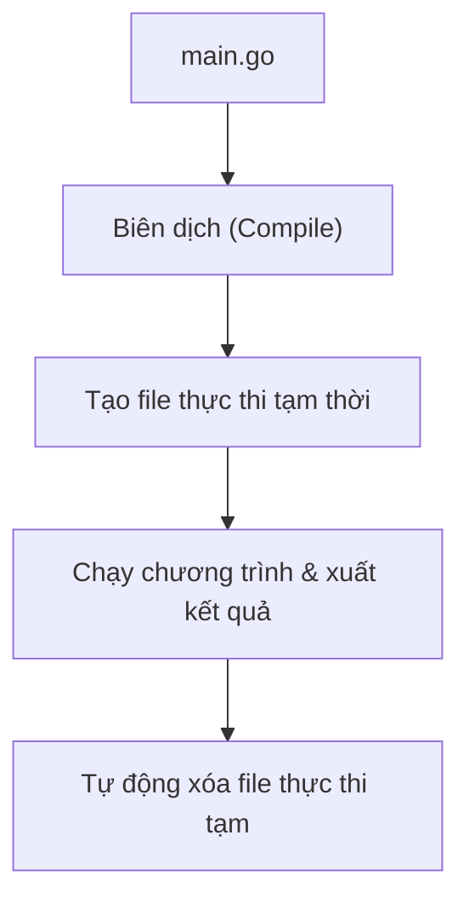

# Bài 4: Chương Trình Go Đầu Tiên (Hello World)

> [!NOTE]
> *Chào mừng bạn viết chương trình Go đầu tiên! Bài học này sẽ giúp bạn bóc tách cấu trúc từng dòng code của một chương trình Go cơ bản, học cách chạy và biên dịch mã nguồn sang file thực thi.*

---

## 1. Cấu Trúc Mã Nguồn "Hello World" Chi Tiết

Dưới đây là mã nguồn đầy đủ của một chương trình Go tối giản:

```go
package main

import "fmt"

func main() {
    fmt.Print("Hello World")
}
```

Hãy cùng phân tích chi tiết ý nghĩa của từng dòng:

### 📁 1. `package main`
* **Ý nghĩa:** Khai báo rằng file code này thuộc package (gói) tên là `main`.
* **Quy tắc:** Trong Go, mọi file mã nguồn đều phải thuộc về một package nào đó (ví dụ: `package math`, `package user`,...).
* **Lưu ý:** Chỉ có `package main` mới chứa điểm chạy chương trình trực tiếp và có thể thực thi bằng lệnh `go run`.

### 🔌 2. `import "fmt"`
* **Ý nghĩa:** Khai báo rằng chương trình sẽ sử dụng thư viện chuẩn `fmt`.
* **So sánh với PHP:** Tương tự như `use SomeClass;` hoặc `require_once "...";` trong PHP.
* **Mô tả:** `fmt` (viết tắt của **format**) là thư viện chuẩn cực kỳ phổ biến của Go, chịu trách nhiệm cho các công việc như:
  * In dữ liệu ra màn hình.
  * Định dạng chuỗi (String formatting).
  * Đọc dữ liệu nhập vào từ bàn phím.

### 🏁 3. `func main()`
* **Ý nghĩa:** Khai báo hàm `main`.
* **Mô tả:** Hàm `main()` là **điểm bắt đầu (Entry Point)** của mọi chương trình Go.
* **Cách hoạt động:** Khi bạn chạy chương trình, Go compiler sẽ tự động tìm kiếm hàm `func main()` đầu tiên và thực thi tuần tự các câu lệnh bên trong nó.

### 📦 4. Cặp ngoặc nhọn `{ }`
* **Ý nghĩa:** Xác định phần thân của hàm.
* **Mô tả:** Tất cả mã lệnh thực thi của hàm phải được viết nằm giữa cặp dấu ngoặc nhọn `{` và `}` này.

### 🖥️ 5. `fmt.Print()`
* **Ý nghĩa:** Gọi hàm `Print` nằm trong package `fmt` để hiển thị dữ liệu ra terminal.
* **Ví dụ:**
  * `fmt.Print("Hello")` ➔ `Hello`
  * `fmt.Print("123")` ➔ `123`

### 💬 6. Tại sao dùng dấu nháy kép `" "` thay vì nháy đơn `' '`?
* **Quy tắc:** Go quy định bắt buộc dùng dấu nháy kép `"Hello"` để biểu diễn **chuỗi (String)**.
* **Giải thích:** Dấu nháy đơn `'A'` chỉ được dùng để biểu diễn một ký tự đơn duy nhất (**Rune**). Nếu viết `'Hello'`, trình biên dịch sẽ báo lỗi lập trình ngay lập tức.

---

## 🚀 Thực Hành Chạy Chương Trình

### Cách 1: Chạy trực tiếp (Sử dụng `go run`)
Để chạy thử nhanh mã nguồn mà không cần tạo ra file nhị phân dư thừa, bạn dùng lệnh:
```bash
go run main.go
```
* **Kết quả hiển thị:** `Hello World`

#### ⚙️ Cơ chế hoạt động ngầm của `go run`:


---

### Cách 2: Biên dịch ra file thực thi (Sử dụng `go build`)
Khi bạn muốn phát hành phần mềm để chạy trực tiếp trên máy chủ hoặc phân phối cho người dùng khác, hãy biên dịch nó thành file nhị phân:
```bash
go build main.go
```
* **Kết quả:** Go sẽ tạo ra một file thực thi nhị phân tên là `main` (hoặc `main.exe` trên Windows) ngay tại thư mục hiện hành.
* **Chạy chương trình vừa build:**
  ```bash
  ./main
  ```

---

## ⚖️ So Sánh Cấu Trúc: Go vs PHP

Hãy cùng nhìn lại sự khác biệt về cấu trúc hiển thị chuỗi đơn giản giữa hai ngôn ngữ:

* **Trong PHP (Scripting - Kiểu tự do):**
  ```php
  <?php
  echo "Hello World";
  ```

* **Trong Go (Compiled - Định hình cấu trúc chặt chẽ):**
  ```go
  package main

  import "fmt"

  func main() {
      fmt.Print("Hello World")
  }
  ```

> [!TIP]
> *Mặc dù mã nguồn Go có vẻ dài dòng hơn đối với bài toán in chuỗi đơn giản, cấu trúc chặt chẽ này giúp hệ thống lớn trở nên rất rõ ràng, nhất quán và cực kỳ dễ bảo trì khi dự án phình to.*

---

## 📝 Tóm Tắt Bài Học
1. **3 Thành phần bắt buộc:** Để chạy được một chương trình Go cơ bản, bạn cần khai báo: `package main` (xác định file chạy chính), `import "fmt"` (thư viện I/O) và `func main()` (hàm khởi chạy).
2. **Biên dịch:** Dùng `go run` để chạy thử nhanh và dùng `go build` khi cần tạo file thực thi để deploy.
