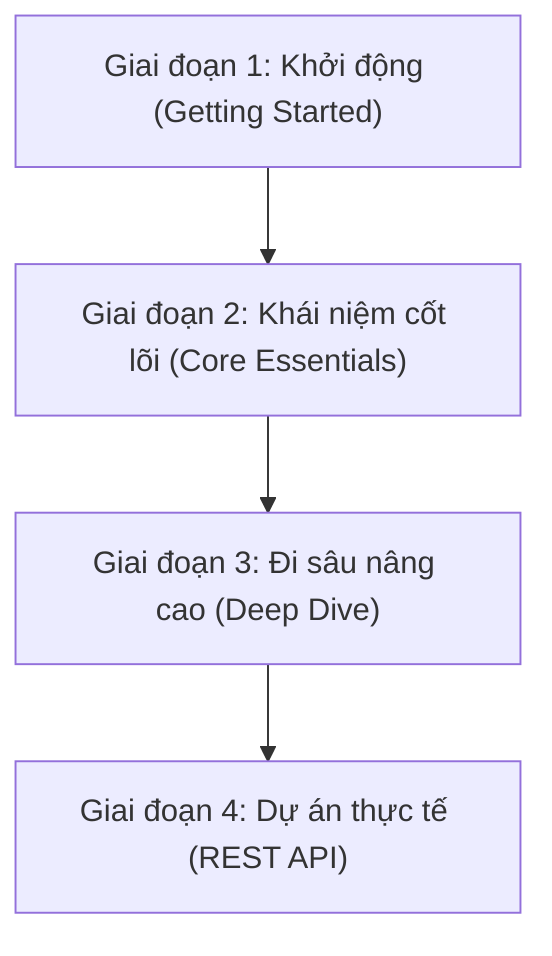

# Tổng Quan Khóa Học & Lộ Trình Học Tập Go

> [!NOTE]
> *Trước khi đi sâu vào tìm hiểu chi tiết về ngôn ngữ Go, tài liệu này sẽ cung cấp cho bạn một cái nhìn tổng quan về lộ trình học tập, các phần học cốt lõi và dự án thực phẩm mà chúng ta sẽ xây dựng cùng nhau.*

---

## 🎯 Lộ Trình Học Tập Tổng Quan (Roadmap)

Để giúp bạn làm chủ Go một cách bài bản nhất, khóa học được chia thành các giai đoạn rõ ràng:

---

## 📝 Chi Tiết Các Giai Đoạn Học Tập

### 1️⃣ Khởi động (Getting Started)
* **Trạng thái:** *Chúng ta đang ở những bước cuối cùng của phần này.*
* **Nội dung:** Thiết lập môi trường phát triển, cài đặt Go Compiler, cấu hình VS Code và chạy chương trình đầu tiên.

### 2️⃣ Khái niệm cốt lõi & Thiết yếu (Core Essentials)
* **Đặc điểm:** *Đây là phần học rất lớn và vô cùng quan trọng.*
* **Nội dung:** 
  * Dẫn dắt bạn qua những khái niệm nền tảng của Go mà bạn **bắt buộc phải biết** cho dù làm việc với bất kỳ dự án Go nào sau này.
  * Khám phá các yếu tố cấu thành nên ngôn ngữ lập trình Go.
  * **Thực hành:** Chúng ta sẽ cùng nhau viết rất nhiều code ở phần này.

### 3️⃣ Đi sâu nâng cao (Deep Dive)
* **Đặc điểm:** *Tiến xa hơn với các tính năng nâng cao.*
* **Nội dung:** 
  * Đi sâu hơn vào cấu trúc của Go.
  * Khám phá từng bước các tính năng quan trọng và phức tạp hơn của ngôn ngữ.
  * Giúp bạn có được nền tảng tư duy vững chắc và toàn diện về ngôn ngữ lập trình Go.

### 4️⃣ Dự án thực tế lớn (Main Project)
* **Đặc điểm:** *Xây dựng từ con số 0 (from the ground up).*
* **Sản phẩm:** Một **REST API (REST Web Service)** hoàn chỉnh.
* **Mục tiêu:** 
  * Áp dụng và kết hợp thực tế tất cả các khái niệm quan trọng bạn đã học được xuyên suốt khóa học.
  * Tự tay xây dựng một dịch vụ web có hiệu năng cao và có cấu trúc chuẩn mực.

---

> [!TIP]
> *Viết code nhiều là chìa khóa để giỏi lập trình. Hãy sẵn sàng viết thật nhiều code và cùng chinh phục dự án REST API ở cuối khóa học nhé!*
